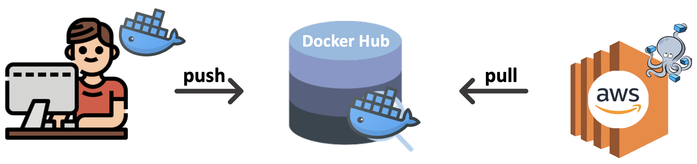

# MSA Development Guide

## ✨ AWS 배포 시 추천합니다!

로컬에서 작업한 소스코드를 AWS 같은 클라우드 서버에 배포할 때, 아래와 같은 순서로 작업하면 편리합니다!


1. 소스코드를 빌드하여 이미지 생성
    -  `docker build -t {계정이름}/{도커허브레포지토리}:{태그명}`
    -  만약, 이미지가 이미 존재한다면 이미지에 태그 붙이기 `docker tag {이미지 이름} {계정이름}/{도커허브레포지토리}:{태그명}`
2. 이미지를 도커 허브로 전송
    - `docker push 이미지 이름` (ex. `docker push ysheee/test:v1`)
3. AWS 서버로 `docker-compose-aws.yml` 파일을 복사하여 `image` 부분을 자신의 허브 이미지 이름으로 바꿔 사용하세요! 
    - (현재 서버에서, 도커 허브에 있는 이미지를 pull 받아 해당 이미지를 사용합니다)
    - MySQL의 PASSWORD, USER 값을 변경하세요

## 📄 application.yml 설정

### Eureka

1. `username`과 `password`를 작성하세요!

```yaml
server:
  port: 8761

spring:
  application:
    name: eureka-server

eureka:
  client:
    register-with-eureka: false
    fetch-registry: false

security:
  username:
  password:
  role: ADMIN
```

### Config

1. `username`과 `password`를 작성하세요!
2. defaultZone: **eureka**의 `username`과 `password`를 작성하세요
3.  defaultZone: 배포 환경에 따라 IP를 변경하세요 (포트는 default port 8761 가정)
    - Local : `localhost:8761`
    - Docker-compose: `{container_name}:8761`
4. private-key를 등록하세요 (Github SSH Key)

#### 1. 로컬에서 사용할 때

```yaml
server:
  port: 9000

eureka:
  client:
    register-with-eureka: true
    fetch-registry: true
    service-url:
      defaultZone: http://{eureka의 username}:{eureka의 password}@localhost:8761/eureka

spring:
  application:
    name: config-server
  cloud:
    config:
      server:
        git:
          uri: git@github.com:KOSA-ToT/tiary-config.git
          ignore-local-ssh-settings: true
          private-key:

security:
  username:
  password:
  role: ADMIN
```

#### 2. docker compose 사용할 때

```yaml
server:
  port: 9000

eureka:
  client:
    register-with-eureka: true
    fetch-registry: true
    service-url:
      defaultZone: http://{eureka의 username}:{eureka의 password}@{eureka_container_name}:8761/eureka

spring:
  application:
    name: config-server
  cloud:
    config:
      server:
        git:
          uri: git@github.com:KOSA-ToT/tiary-config.git
          ignore-local-ssh-settings: true
          private-key:

security:
  username:
  password:
  role: ADMIN
```

### Gateway

1. defaultZone: **eureka**의 `username`과 `password`를 작성하세요
2. defaultZone: 배포 환경에 따라 **eureka**의 IP를 변경하세요 (포트는 default port 8761 가정)
    - Local : `localhost:8761`
    - Docker-compose: `{container_name}:8761`
3. allowedOrigins: CORS 설정입니다. Client IP에 맞춰 작성하세요
``` yaml
server:
  port: 8090

### Local
# eureka:
#   client:
#     register-with-eureka: true
#     fetch-registry: true
#     service-url:
#       defaultZone: http://{eureka의 username}:{eureka의 password}@localhost:8761/eureka

## Deploy
eureka:
  client:
    register-with-eureka: true
    fetch-registry: true
    service-url:
      defaultZone: http://{eureka의 username}:{eureka의 password}@{eureka_container_name}:8761/eureka

spring:
  application:
    name: gateway
  cloud:
    gateway:
      default-filters:
        - DedupeResponseHeader=Access-Control-Allow-Origin Access-Control-Allow-Credentials
      globalcors:
        add-to-simple-url-handler-mapping: true
        cors-configurations:
          "[/**]":
            allowedOrigins:
              - "http://localhost:5173"
              - "http://0.0.0.0:5173"
            allow-credentials: true
            allowedHeaders: "*"
            exposedHeaders: "*"
            allowedMethods:
              - PUT
              - GET
              - POST
              - DELETE
              - PATCH
              - OPTIONS
      routes:
        - id: server
          uri: lb://SERVER
          predicates:
            - Path=/server/**
          filters:
            - RewritePath=/server/(?<segment>.*), /$\{segment}
        - id: batch
          uri: lb://BATCH
          predicates:
            - Path=/batch/**
        - id: payment
          uri: lb://PAYMENT
          predicates:
            - Path=/payment/**

```


### Server

1. import: **config**의 `username`과 `password`를 작성하세요
2.  `name`과 `active`를 상황에 맞게 변경하세요

만약, config 레포지토리에 있는 파일의 이름이 `server-dev.yml`라면 아래와 같습니다

#### 1. 로컬에서 사용할 때
``` yaml
spring:
  application:
    name: server
  profiles:
    active: dev
  config:
    import: optional:configserver:http://{config의 username}:{config의 비밀번호}@localhost:9000
```

#### 2. docker compose 사용할 때
``` yaml
spring:
  application:
    name: server
  profiles:
    active: dev
  config:
    import: optional:configserver:http://{config의 username}:{config의 비밀번호}@{config_container_name}:9000
```

### Batch

1. import: **config**의 `username`과 `password`를 작성하세요
2.  `name`과 `active`를 상황에 맞게 변경하세요!

만약, config 레포지토리에 있는 파일의 이름이 `batch-dev.yml`라면 아래와 같습니다

#### 1. 로컬에서 사용할 때
``` yaml
spring:
  application:
    name: batch
  profiles:
    active: dev
  config:
    import: optional:configserver:http://{config의 username}:{config의 비밀번호}@localhost:9000
```

#### 2. docker compose 사용할 때
``` yaml
spring:
  application:
    name: batch
  profiles:
    active: dev
  config:
    import: optional:configserver:http://{config의 username}:{config의 비밀번호}@{config_container_name}:9000
```

### Payment

1. import: **config**의 `username`과 `password`를 작성하세요
2.  `name`과 `active`를 상황에 맞게 변경하세요!

만약, config 레포지토리에 있는 파일의 이름이 `payment-dev.yml`라면 아래와 같습니다

#### 1. 로컬에서 사용할 때
``` yaml
spring:
  application:
    name: payment
  profiles:
    active: dev
  config:
    import: optional:configserver:http://{config의 username}:{config의 비밀번호}@localhost:9000
```

#### 2. docker compose 사용할 때
``` yaml
spring:
  application:
    name: payment
  profiles:
    active: dev
  config:
    import: optional:configserver:http://{config의 username}:{config의 비밀번호}@{config_container_name}:9000
```

### Client

1. .env.example을 복사하여 .env 파일을 생성하세요
``` bash
cp -v .env.example .env
```
2. .env 파일에서 `localhost`를 각 상황에 맞는 IP로 변경하세요
3. TossPayment의 VITE_CLIENT_KEY를 각 상황에 맞게 입력하세요 